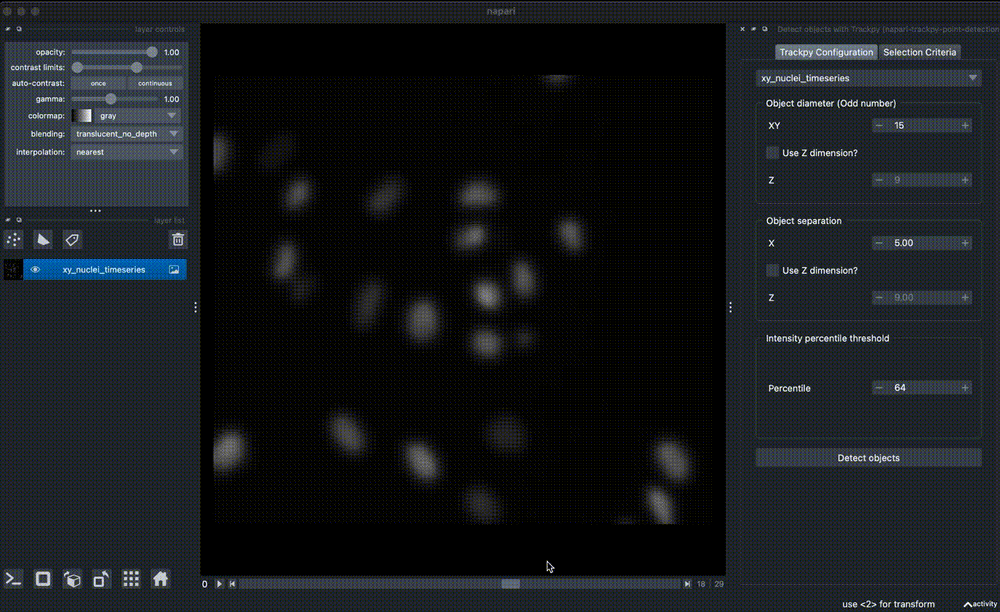
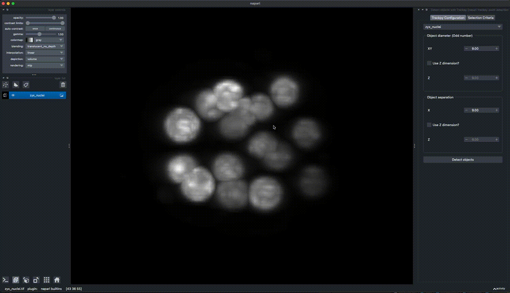
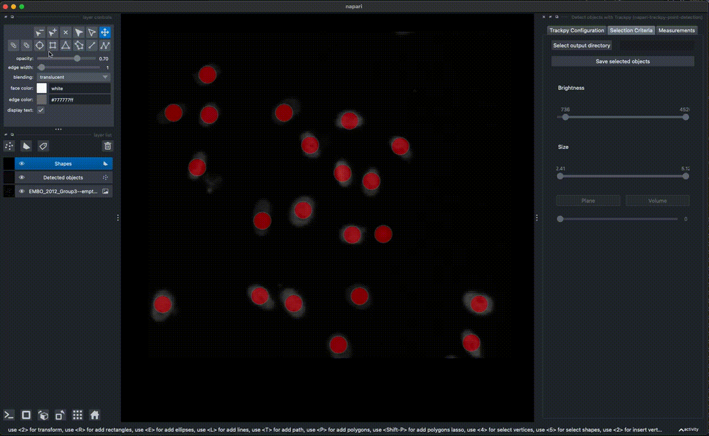

# napari-trackpy-point-detection

A Napari plugin for detecting objects in 2D, 2D + time, 3D, and 3D + time, using the locate function from [TrackPy](https://pypi.org/project/trackpy/) and works best on objects that have a similar size and smooth intensity profile. Detected points can be filtered afterwards based on size and intensity. When detecting 3D objects in very crowded samples, the 3D 'Plane' view may make it easier to see the detected objects. Point intensities on image layers can be measured and visualized in a napari-skimage-regionprops inspired table widget, optionally per region. 

----------------------------------

This [napari] plugin was generated with [Cookiecutter] using [@napari]'s [cookiecutter-napari-plugin] template.

## Installation

You can install `napari-trackpy-point-detection` via [pip]:

To install latest development version :

    pip install git+https://github.com/AnniekStok/napari-trackpy-point-detection.git

## Usage

Choose an estimated diameter in xy (and optionally z) (this must be an odd integer) and an estimated distance between objects. When your data is 3D but you leave the 'Use Z dimension' checkbox unticked, the third dimension will be treated as time, meaning that objects are detected frame by frame. The 'Intensity percentile threshold' parameter can be used to filter out dimmer objects that are below set intensity percentile. 

#### Detection of 2D objects over time

#### Detection of 3D objects

### Measuring intensity at point detections, with optional regions derived from Shapes or Labels layers

## Contributing

Contributions are very welcome. Tests can be run with [tox], please ensure
the coverage at least stays the same before you submit a pull request.

## License

Distributed under the terms of the [BSD-3] license,
"napari-trackpy-point-detection" is free and open source software

## Issues

If you encounter any problems, please [file an issue] along with a detailed description.

[napari]: https://github.com/napari/napari
[Cookiecutter]: https://github.com/audreyr/cookiecutter
[@napari]: https://github.com/napari
[MIT]: http://opensource.org/licenses/MIT
[BSD-3]: http://opensource.org/licenses/BSD-3-Clause
[GNU GPL v3.0]: http://www.gnu.org/licenses/gpl-3.0.txt
[GNU LGPL v3.0]: http://www.gnu.org/licenses/lgpl-3.0.txt
[Apache Software License 2.0]: http://www.apache.org/licenses/LICENSE-2.0
[Mozilla Public License 2.0]: https://www.mozilla.org/media/MPL/2.0/index.txt
[cookiecutter-napari-plugin]: https://github.com/napari/cookiecutter-napari-plugin

[file an issue]: https://github.com/AnniekStok/napari-trackpy-point-detection/issues

[napari]: https://github.com/napari/napari
[tox]: https://tox.readtheinstructions.io/en/latest/
[pip]: https://pypi.org/project/pip/
[PyPI]: https://pypi.org/
